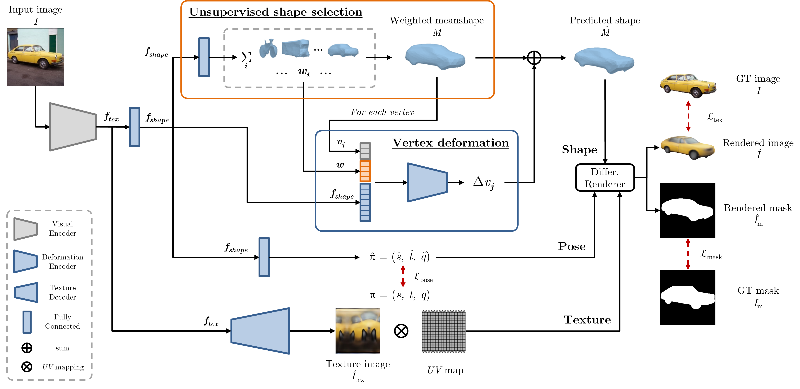

# Multi-Category Mesh Reconstruction From Image Collections
This is the official PyTorch implementation of the publication:

*A. Simoni, S. Pini, R. Vezzani, R. Cucchiara* </br>
**Multi-Category Mesh Reconstruction From Image Collections** </br>
*In International Conference on 3D Vision (3DV) 2021*

**[[Paper](https://arxiv.org/abs/2110.11256)]**

<p align="center" width="100%">
  
</p>

Recently, learning frameworks have shown the capability of inferring the accurate shape, pose, and texture of an object from a single RGB image. 
However, current methods are trained on image collections of a single category in order to exploit specific priors, and they often make use of category-specific 3D templates. 
In this paper, we present an alternative approach that infers the textured mesh of objects combining a series of deformable 3D models and a set of instance-specific deformation, pose, and texture. 
Differently from previous works, our method is trained with images of multiple object categories using only foreground masks and rough camera poses as supervision. 
Without specific 3D templates, the framework learns category-level models which are deformed to recover the 3D shape of the depicted object. 
The instance-specific deformations are predicted independently for each vertex of the learned 3D mesh, enabling the dynamic subdivision of the mesh during the training process. 
Experiments show that the proposed framework can distinguish between different object categories and learn category-specific shape priors in an unsupervised manner. 
Predicted shapes are smooth and can leverage from multiple steps of subdivision during the training process, obtaining comparable or state-of-the-art results on two public datasets. 
Models and code are publicly released.

## Getting Started

### Environment

Create your Python environment and install the required packages with the following commands:

```bash
conda create -n <env_name> python=3.6
conda activate <env_name>
pip install -r requirements.txt
```

Install [PyTorch](https://pytorch.org/) 1.5.1 and TorchVision 0.6.1 with CudaToolkit 10.2.

### Renderer

Install [SoftRas Renderer](https://github.com/ShichenLiu/SoftRas) extension:
```bash
export CUDA_HOME=/path/to/cuda
cd mcmr/
python setup_softras.py build develop       # install to workspace
```

The renderer was compiled using CUDA 10.2.

### PyTorch3D

Install PyTorch3D v0.4.0 (https://pytorch3d.org/ -- [GitHub repository](https://github.com/facebookresearch/pytorch3d/))

```bash
conda install -c bottler nvidiacub
# OR
curl -LO https://github.com/NVIDIA/cub/archive/1.10.0.tar.gz
tar xzf 1.10.0.tar.gz
export CUB_HOME=$PWD/cub-1.10.0

pip install fvcore iopath

pip install "git+https://github.com/facebookresearch/pytorch3d.git@v0.4.0"
```

## Dataset preparation
Please follow the instructions from [mcmr Data Preparation](datasets/DATASET.md).

## Training
### Pascal3D+
Run the following script:
```bash
python main.py --dataset_name pascal \
               --dataset_dir your-folder/datasets/PASCAL_final \
               --classes <class-names> \
               --sub_classes \                                 # train on PASCAL3D+ 3D models sub-classes
               --single_mean_shape \                           # use single meanshape training
               --cmr_mode \                                    # use GT+MaskRCNN instead of GT+PointRend masks
               --subdivide 4 \                                 # starting mesh subdivision level
               --sdf_subdivide_steps 351 \                     # mesh subdivision epoch steps
               --use_learned_class \                           # activate unsupervised shape selection module
               --num_learned_meanshapes <num-of-meanshapes> \  # set number of meanshapes
               --checkpoint_dir <checkpoint-directory> \
               --log_dir <log-directory> \
               --pretrained_weights <weights-file> \           # resume from pre-trained weights
               --cam_loss_wt 20.0 \
               --cam_reg_wt 0.1 \
               --mask_loss_wt 100.0 \
               --deform_reg_wt 0.05 \
               --laplacian_wt 6.0 \             
               --laplacian_delta_wt 1.8 \
               --graph_laplacian_wt 0. \
               --tex_percept_loss_wt 0.8 \
               --tex_color_loss_wt 0.03 \
               --tex_pixel_loss_wt 0.005 \
               --is_training \                                  # activate training mode
               (--faster)                                       # disable deterministic mode
```
### CUB
Run the following script:
```bash
python main.py --dataset_name cub \
               --dataset_dir your-folder/datasets/UCMR_CUB_data/cub/ \
               --classes all \
               --single_mean_shape \                           # use single meanshape training
               --subdivide 4 \                                 # starting mesh subdivision level
               --sdf_subdivide_steps 351 \                     # mesh subdivision epoch steps
               --use_learned_class \                           # activate unsupervised shape selection module
               --num_learned_meanshapes <num-of-meanshapes> \  # set number of meanshapes
               --checkpoint_dir <checkpoint-directory> \
               --log_dir <log-directory> \
               --pretrained_weights <weights-file> \           # resume from pre-trained weights
               --cam_loss_wt 2.0 \
               --cam_reg_wt 0.1 \
               --mask_loss_wt 20.0 \
               --deform_reg_wt 0.005 \
               --laplacian_wt 1.2 \             
               --laplacian_delta_wt 0.18 \
               --graph_laplacian_wt 0. \
               --tex_percept_loss_wt 3.2 \
               --tex_color_loss_wt 0.12 \
               --tex_pixel_loss_wt 0.02 \
               --is_training \                                  # activate training mode
               (--faster)                                       # disable deterministic mode
```

## Testing with pre-trained weights
Original paper experiments can be reproduced as follows:
1) Download pre-trained weights from [mcmr Model Zoo](models/MODELZOO.md).
2) Run the testing script as follows:

#### 2.1. Pascal3D+:
```bash
python main.py --dataset_name pascal \
               --dataset_dir your-folder/datasets/PASCAL_final \
               --classes <class-names> \
               --sub_classes \                                 # activate intra-class variation
               --cmr_mode \                                    # use of GT+MaskRCNN masks instead of GT+PointRend
               --subdivide 4 \                                 # starting mesh subdivision level
               --sdf_subdivide_steps 351 \                     # mesh subdivision epoch steps
               --use_learned_class \
               --num_learned_meanshapes <num-of-meanshapes> \  # set number of meanshapes
               --checkpoint_dir <checkpoint-directory> \
               --log_dir <log-directory> \
               --pretrained_weights <weights-file> \           # load pre-trained weights for testing
               --cam_loss_wt 20.0 \
               --cam_reg_wt 0.1 \
               --mask_loss_wt 100.0 \
               --deform_reg_wt 0.05 \
               --laplacian_wt 6.0 \             
               --laplacian_delta_wt 1.8 \
               --graph_laplacian_wt 0. \
               --tex_percept_loss_wt 0.8 \
               --tex_color_loss_wt 0.03 \
               --tex_pixel_loss_wt 0.005 \
               --save_dir <save-directory> \                    # directory to save qualitative results
               --save_results \                                 # activate qualitative results saving
               --qualitative_results \                          # activate qualitative results with weighted meanshape saving 
               (--faster)                                       # disable deterministic mode
```
#### 2.2. CUB:
```bash
python main.py --dataset_name cub \
               --dataset_dir your-folder/datasets/UCMR_CUB_data/cub/ \
               --classes all \
               --single_mean_shape \                           # use single meanshape training
               --subdivide 4 \                                 # starting mesh subdivision level
               --sdf_subdivide_steps 351 \                     # mesh subdivision epoch steps
               --use_learned_class \                           # activate unsupervised shape selection module
               --num_learned_meanshapes <num-of-meanshapes> \  # set number of meanshapes
               --checkpoint_dir <checkpoint-directory> \
               --log_dir <log-directory> \
               --pretrained_weights <weights-file> \           # load pre-trained weights for testing
               --cam_loss_wt 2.0 \
               --cam_reg_wt 0.1 \
               --mask_loss_wt 20.0 \
               --deform_reg_wt 0.005 \
               --laplacian_wt 1.2 \             
               --laplacian_delta_wt 0.18 \
               --graph_laplacian_wt 0. \
               --tex_percept_loss_wt 3.2 \
               --tex_color_loss_wt 0.12 \
               --tex_pixel_loss_wt 0.02 \
               --save_dir <save-directory> \                    # directory to save qualitative results
               --save_results \                                 # activate qualitative results saving
               --qualitative_results \                          # activate qualitative results with weighted meanshape saving 
               (--faster)                                       # disable deterministic mode
```

## Updates
- [x] Add model implementation
- [x] Add dataloader implementation
- [x] Add train/test scripts
- [x] Add preprocessed dataset request instructions
- [x] Add dataset preprocessing instructions and scripts
- [x] Add train/test instructions
- [x] Add pretrained models

## Authors
* **Alessandro Simoni** - [alexj94](https://github.com/alexj94)
* **Stefano Pini** - [stefanopini](https://github.com/stefanopini)
* **Roberto Vezzani** - [robervez](https://github.com/robervez)
* **Rita Cucchiara** - [Rita Cucchiara](https://aimagelab.ing.unimore.it/imagelab/person.asp?idpersona=1)

## Citation
If you find this repository useful for your research, please cite the following paper:
```bibtex
@inproceedings{simoni2021multi,
  title={Multi-Category Mesh Reconstruction From Image Collections},
  author={Simoni, Alessandro and Pini, Stefano and Vezzani, Roberto and Cucchiara, Rita},
  booktitle={2021 International Conference on 3D Vision (3DV)},
  pages={1321--1330},
  year={2021},
  organization={IEEE}
}
```

## License
This project is licensed under the MIT License - see the [LICENSE](LICENSE) file for detail
